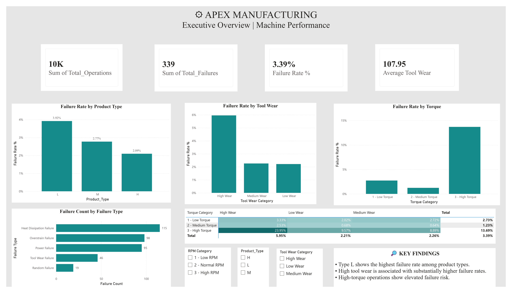
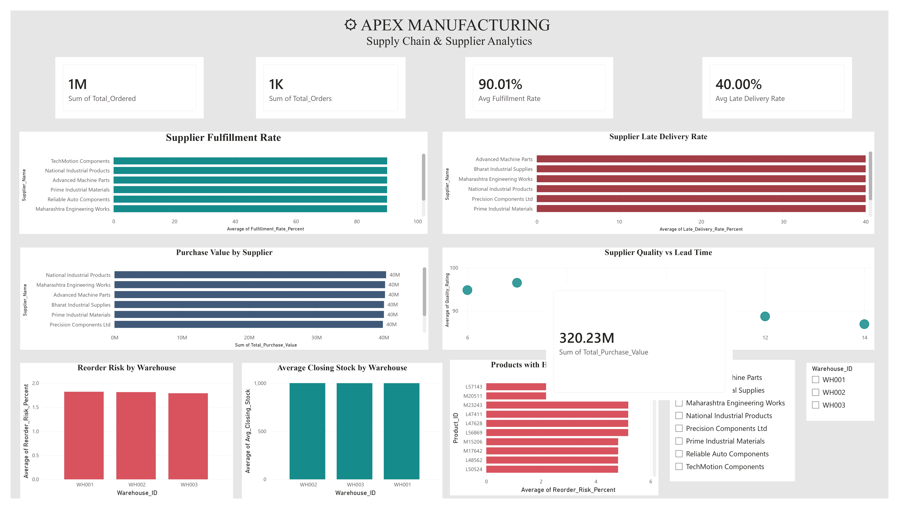
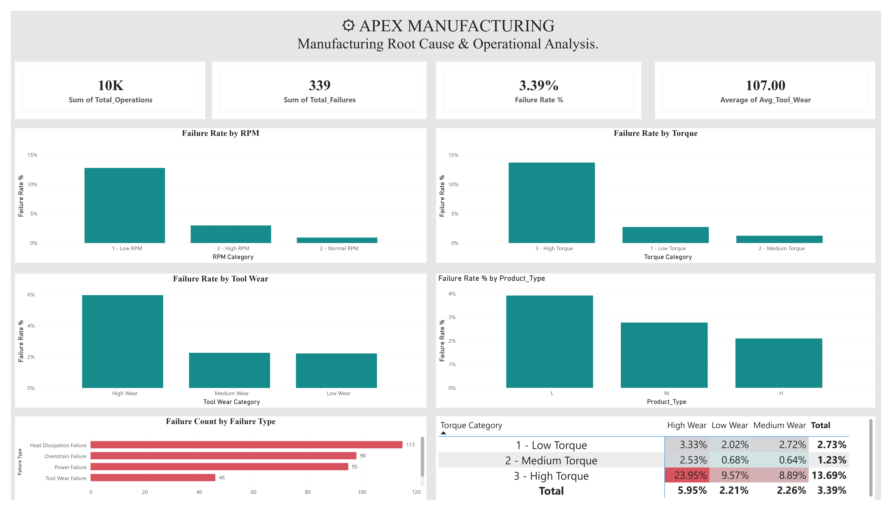
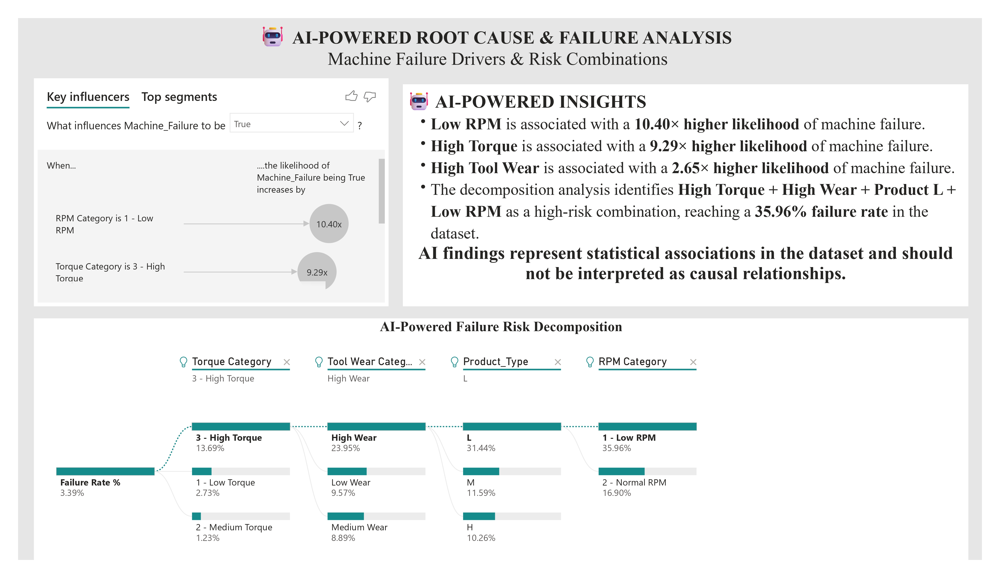
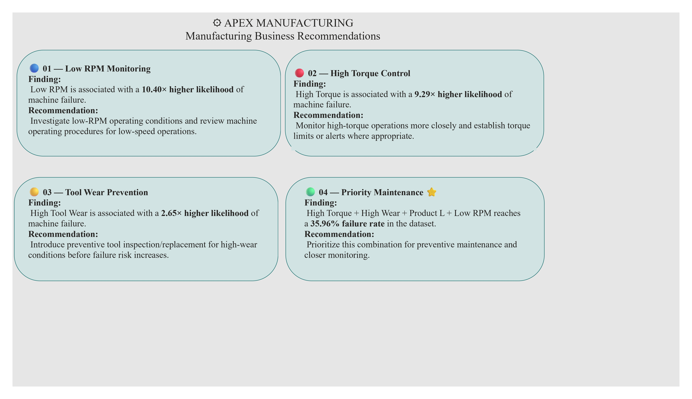

# 🏭 Apex Manufacturing Analytics | Power BI + SQL Data Warehouse

<p align="center">
  <strong>End-to-End Manufacturing Analytics & Business Intelligence Project</strong>
</p>

<p align="center">


</p>

---


# 📌 Project Overview

**Apex Manufacturing Analytics** is an end-to-end Business Intelligence project developed using **SQL Server and Microsoft Power BI**.

The project transforms manufacturing, supplier, purchasing, and inventory data into actionable business insights through:

- 🗄️ SQL Data Warehousing
- 📊 Power BI dashboards
- 🧮 DAX-based KPI analysis
- 🤖 AI-powered analytics
- 🧪 SQL-to-Power BI validation
- 💼 Data-driven business recommendations

The objective is to help manufacturing stakeholders understand **machine failures, supplier performance, inventory risk, and operational bottlenecks** and make better data-driven decisions.

---

# 🎯 Business Problem

Manufacturing organizations generate large volumes of operational and supply-chain data.

However, raw data does not immediately answer questions such as:

- Which operating conditions are associated with machine failures?
- Which failure types occur most frequently?
- Which suppliers have fulfillment or delivery issues?
- Which warehouses have higher reorder risk?
- Which products require inventory attention?
- Which operating combinations should receive preventive maintenance?

This project addresses these questions by building an end-to-end analytics solution.

---

# 🚀 Project Architecture

```text
Raw Manufacturing Data
          ↓
      Staging Layer
          ↓
   SQL Data Warehouse
          ↓
 ┌───────────────────────┐
 │ Fact & Dimension Data │
 └───────────────────────┘
          ↓
   Analytical SQL Views
          ↓
      Power BI Model
          ↓
 ┌───────────────────────┐
 │ Interactive Dashboards│
 └───────────────────────┘
          ↓
   AI-Powered Analysis
          ↓
 Business Recommendations
````

---

# 🗄️ SQL Data Warehouse

The project uses a structured SQL Server data warehouse to organize manufacturing, supplier, purchasing, and inventory data for analysis.

## Dimension Tables

| Table                    | Purpose                     |
| ------------------------ | --------------------------- |
| `warehouse.dim_product`  | Stores product information  |
| `warehouse.dim_supplier` | Stores supplier information |

## Fact Tables

| Table                               | Purpose                                                           |
| ----------------------------------- | ----------------------------------------------------------------- |
| `warehouse.fact_machine_operations` | Machine operations, operating parameters, and failure information |
| `warehouse.fact_purchase_orders`    | Purchase orders, supplier deliveries, quantities, and costs       |
| `warehouse.fact_inventory`          | Inventory levels, closing stock, and reorder levels               |

---

# 📐 Analytical SQL Views

Two major analytical views were created to simplify Power BI reporting and business analysis.

## `analytics.vw_supplier_performance`

Used to analyze:

* Supplier fulfillment rate
* Late delivery rate
* Total orders
* Ordered quantity
* Received quantity
* Purchase value
* Supplier quality
* Supplier lead time

## `analytics.vw_inventory_risk`

Used to analyze:

* Inventory days
* Average closing stock
* Minimum stock
* Reorder-risk days
* Reorder-risk percentage

---

# 📊 Power BI Dashboards

The Power BI report contains multiple analytical pages designed for different business perspectives.

---

# 1️⃣ Executive Overview

Provides a high-level overview of manufacturing performance.

## Key KPIs

* Total Operations
* Total Failures
* Failure Rate
* Average Tool Wear

## Key Visuals

* Failure Rate by Product Type
* Failure Rate by Tool Wear
* Failure Rate by Torque
* Failure Rate by RPM
* Failure Count by Failure Type
* Torque × Tool Wear Failure Rate Matrix

### Dashboard Preview



---

# 2️⃣ Supply Chain & Supplier Analytics

Analyzes supplier performance, purchasing, and inventory risk.

## Key KPIs

* Total Ordered
* Total Orders
* Average Fulfillment Rate
* Average Late Delivery Rate

## Key Visuals

* Supplier Fulfillment Rate
* Supplier Late Delivery Rate
* Purchase Value by Supplier
* Supplier Quality vs Lead Time
* Reorder Risk by Warehouse
* Average Closing Stock by Warehouse
* Top 10 Products by Reorder Risk

### Dashboard Preview



---

# 3️⃣ Manufacturing Root Cause & Operational Analysis

Focuses on operating conditions associated with machine failures.

## Key KPIs

* Total Operations
* Total Failures
* Failure Rate
* Average Tool Wear

## Key Visuals

* Failure Rate by RPM
* Failure Rate by Torque
* Failure Rate by Tool Wear
* Failure Rate by Product Type
* Failure Count by Failure Type
* Torque × Tool Wear Failure Matrix

### Dashboard Preview



---

# 4️⃣ 🤖 AI-Powered Failure Analysis

Power BI AI capabilities were used to identify important machine-failure drivers and high-risk combinations.

## 🔍 Key Influencers

The analysis investigated:

* RPM Category
* Torque Category
* Tool Wear Category
* Product Type

### Important Findings

🟢 **Low RPM** — **10.40× higher likelihood** of machine failure

🔴 **High Torque** — **9.29× higher likelihood** of machine failure

🟡 **High Tool Wear** — **2.65× higher likelihood** of machine failure

---

## 🌳 Decomposition Tree

The AI-driven analysis identified the following high-risk path:

```text
Overall Failure Rate
       3.39%
          ↓
     High Torque
       13.69%
          ↓
      High Wear
       23.95%
          ↓
       Product L
       31.44%
          ↓
       Low RPM
       35.96%
```

This indicates that the combination of:

> **High Torque + High Tool Wear + Product L + Low RPM**

is associated with a **35.96% failure rate** within the analyzed dataset.

> ⚠️ **Important:** AI findings represent statistical associations within the dataset and should not be interpreted as causal relationships.

### Dashboard Preview



---

# 5️⃣ 💼 Business Recommendations

The analytical findings were translated into actionable recommendations.

## 🔵 01 — Low RPM Monitoring

**Finding:**
Low RPM is associated with a **10.40× higher likelihood** of machine failure.

**Recommendation:**
Investigate low-RPM operating conditions and review machine operating procedures for low-speed operations.

---

## 🔴 02 — High Torque Control

**Finding:**
High Torque is associated with a **9.29× higher likelihood** of machine failure.

**Recommendation:**
Monitor high-torque operations more closely and establish torque limits or alerts where appropriate.

---

## 🟡 03 — Tool Wear Prevention

**Finding:**
High Tool Wear is associated with a **2.65× higher likelihood** of machine failure.

**Recommendation:**
Introduce preventive tool inspection or replacement for high-wear conditions before failure risk increases.

---

## 🟢 04 — Priority Maintenance ⭐

**Finding:**

**High Torque + High Wear + Product L + Low RPM → 35.96% failure rate**

**Recommendation:**
Prioritize this combination for preventive maintenance and closer monitoring.

### Dashboard Preview



---

# 📈 Key Business Findings

## 🏭 Manufacturing

| Metric                               |     Result |
| ------------------------------------ | ---------: |
| Total Operations                     | **10,000** |
| Total Failures                       |    **339** |
| Failure Rate                         |  **3.39%** |
| Heat Dissipation Failures            |    **115** |
| High Torque + High Wear Failure Rate | **23.95%** |
| High-risk AI combination             | **35.96%** |

## 📦 Supply Chain

| Metric                     |            Result |
| -------------------------- | ----------------: |
| Average Fulfillment Rate   |        **90.01%** |
| Average Late Delivery Rate |        **40.00%** |
| Total Purchase Value       |   **320,233,500** |
| Warehouse Reorder Risk     | **1.79% – 1.82%** |

---

# 🧪 Validation & Testing

The Power BI dashboard was validated against SQL Server analytical views and source data.

| Metric                     |         SQL |    Power BI | Status |
| -------------------------- | ----------: | ----------: | ------ |
| Total Operations           |      10,000 |      10,000 | ✅      |
| Total Failures             |         339 |         339 | ✅      |
| Heat Dissipation Failures  |         115 |         115 | ✅      |
| Failure Rate               |       3.39% |       3.39% | ✅      |
| Average Fulfillment Rate   |      90.01% |      90.01% | ✅      |
| Average Late Delivery Rate |      40.00% |      40.00% | ✅      |
| Total Purchase Value       | 320,233,500 | 320,233,500 | ✅      |

## 🔎 Validation Insight

During validation, an initial purchase-order-level fulfillment calculation produced **89.02%**, while Power BI showed **90.01%**.

The difference was traced to the aggregation level used in the analytical view.

The final dashboard uses supplier-level fulfillment rates from:

`analytics.vw_supplier_performance`

The validated result was:

**SQL = 90.01%**

**Power BI = 90.01%**

✅ **Validation passed.**

---

# 🧮 Power BI & DAX

The project uses Power BI and DAX for KPI calculations, segmentation, and interactive analysis.

Key calculations include:

* Total Operations
* Total Failures
* Failure Rate %
* Average Tool Wear
* Failure Counts
* Average Fulfillment Rate
* Average Late Delivery Rate
* Reorder Risk
* Inventory metrics

Categorical dimensions such as:

* RPM
* Torque
* Tool Wear
* Product Type
* Supplier
* Warehouse

are used for interactive segmentation and analysis.

---

# 🤖 AI Integration

Power BI AI capabilities were used to move beyond descriptive reporting.

## Key Influencers

Identifies variables associated with higher machine-failure likelihood.

## Decomposition Tree

Explores how combinations of operating conditions correspond to progressively higher failure rates.

The AI layer supports **investigation and prioritization** rather than establishing causal relationships.

---

# 🛠️ Technologies Used

<p align="center">


</p>

* SQL Server
* T-SQL
* Data Warehousing
* Power BI
* DAX
* Power Query
* Data Modeling
* AI-powered Power BI visuals
* Data Validation
* Business Intelligence

---

# 📁 Repository Structure

```text
Apex-Manufacturing-Analytics/
│
├── README.md
│
├── SQL/
│   ├── 01_Database_Setup/
│   ├── 02_Staging/
│   ├── 03_Data_Warehouse/
│   ├── 04_Analytical_Views/
│   └── 05_Validation/
│
├── PowerBI/
│   └── Apex_Manufacturing_Analytics.pbix
│
├── Dashboard_Screenshots/
│   ├── 01_Executive_Overview.png
│   ├── 02_Supply_Chain_Analytics.png
│   ├── 03_Manufacturing_Root_Cause.png
│   ├── 04_AI_Failure_Analysis.png
│   └── 05_Business_Recommendations.png
│
├── Documentation/
│   └── Project_Documentation.pdf
│
└── Data/
    └── README.md
```

---

# 💡 Business Impact

The solution enables stakeholders to:

* Identify high-risk machine operating conditions
* Prioritize preventive maintenance
* Monitor supplier performance
* Identify delivery-risk areas
* Monitor inventory reorder risk
* Understand failure-mode patterns
* Identify high-risk products
* Support data-driven operational decisions

---

# 🔮 Future Improvements

Potential future enhancements include:

* Predictive machine-failure modeling
* Machine-failure probability scoring
* Automated maintenance alerts
* Supplier risk scoring
* Inventory demand forecasting
* Time-series monitoring
* Automated Power BI refresh
* Machine-learning-based failure prediction

---

# 👩‍💻 Skills Demonstrated

```text
SQL
 ↓
Data Warehousing
 ↓
Data Modeling
 ↓
Data Analysis
 ↓
DAX
 ↓
Power BI
 ↓
AI Analytics
 ↓
Validation & Testing
 ↓
Business Recommendations
```

This project demonstrates an end-to-end **Data Analyst / Business Intelligence workflow**.

---

# ⭐ Project Status

<p align="center">


</p>

<p align="center">
  <strong>End-to-End Manufacturing Analytics Solution</strong>
</p>

<p align="center">
  SQL Server • Data Warehouse • Power BI • DAX • AI • Business Intelligence
</p>

---

